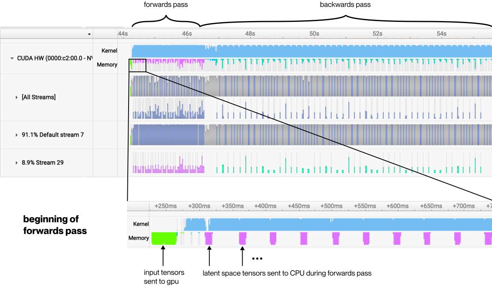
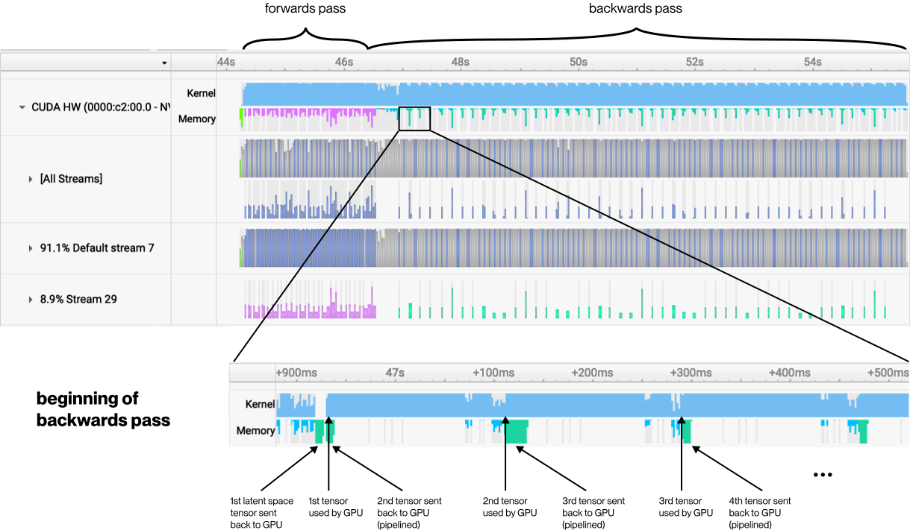

# Matepoint


## Overview

Matepoint is a fork of PyTorch's `torch.utils.checkpoint` that allows you to utilize CPU RAM when you're low on GPU VRAM. While standard checkpointing trades computation for memory by recomputing activations during the backward pass, Matepoint takes this further by:

1. Automatically offloading activation tensors to CPU after the forward pass
2. Efficiently moving tensors back to GPU only when needed during the backward pass
3. Supporting pipelined tensor transfers for better performance
4. Providing optional CPU memory pooling for large, similarly-shaped tensors


## How Matepoint Compares

PyTorch offers several ways to reduce activation memory. Here's where matepoint fits:

| Approach | Mechanism | Async pipelining | Drop-in? |
|---|---|---|---|
| `torch.utils.checkpoint` | Recompute activations (no CPU offload) | N/A | Yes |
| `torch.autograd.graph.save_on_cpu` | Offload all saved tensors to CPU | No — GPU stalls on backward | Yes |
| torchtune `OffloadActivations` | Offload via saved_tensors_hooks + CUDA stream | Yes | Yes |
| **Matepoint** | Extends checkpoint with CPU offload + CUDA stream pipelining | **Yes** | Yes |

The key difference: `save_on_cpu` is synchronous (reported ~6x slowdown), while matepoint and torchtune both use a dedicated CUDA stream to overlap CPU↔GPU transfers with computation. Matepoint integrates this directly into the checkpoint API — recomputation + offloading + pipelining in one `checkpoint()` call.

## Usage

Replace your existing `torch.utils.checkpoint` calls with `matepoint`:

```python
from matepoint import checkpoint

# Instead of:
# from torch.utils.checkpoint import checkpoint

def forward(self, x):
    # Use exactly like torch.utils.checkpoint
    out = checkpoint(self.layer, x, use_reentrant=False)
    return out
```

## Requirements

- PyTorch >= 2.4.0
- CUDA-capable GPU
- Sufficient CPU memory for activation storage

## Installation

```bash
pip install --index-url https://test.pypi.org/simple/ matepoint
```

## Build
```bash
rm -rf dist/ build/ .egg-info
python setup.py sdist bdist_wheel
twine upload --repository testpypi dist/*
# if needed, can specify exact version
# twine upload --repository testpypi dist/matepoint-0.1.7* 
```

## References
Refer to the Matepoint section in this [blog post](https://windbornesystems.com/blog/weathermesh-2-technical-blog) for more details on the implementation and performance benefits.

## License

This project is licensed under the MIT License - see the [LICENSE](LICENSE) file for details.

## Real-World Example

We actually built Matepoint when we were running out of VRAM trying to solve weather(™) with transformers. While WeatherMesh, our model itself isn't huge (~180M parameters), forecasting weather for the entire planet over 6 days means running through 200+ transformer layers.

Without some clever tricks, we'd need hundreds of GiB of VRAM. Even regular checkpointing wasn't enough - storing those 200MiB latent tensors for each transformer block would eat up around 40GiB of VRAM, which is more than even an RTX 4090 can handle.

Matepoint ships those tensors off to CPU RAM when we don't need them, then brings them back just in time during the backward pass. Adding more forecast days costs almost nothing in VRAM terms. This meant we could train our whole weather model on consumer RTX 4090s instead of shelling out for pricier hardware.

Check out these visualizations to see Matepoint in action:




## LLM Example: nanochat

We benchmarked matepoint on [Karpathy's nanochat](https://github.com/karpathy/nanochat) GPT models on an RTX 4090 (24 GB VRAM, 504 GB RAM):

| Model | Batch | Mode | Peak VRAM | Step Time | Throughput | CPU RAM |
|---|---|---|---|---|---|---|
| d12 (286M) | 8 | Baseline | 16.04 GB | 202 ms | 81k tok/s | +0.4 GB |
| d12 (286M) | 8 | Matepoint | **10.63 GB** | 258 ms | 64k tok/s | +0.9 GB |
| d12 (286M) | 16 | Baseline | OOM | — | — | — |
| d12 (286M) | 16 | Matepoint | **18.99 GB** | 513 ms | 64k tok/s | +1.5 GB |
| d20 (897M) | 4 | Baseline | 20.03 GB | 295 ms | 28k tok/s | +0.4 GB |
| d20 (897M) | 4 | Matepoint | **12.04 GB** | 383 ms | 21k tok/s | +1.3 GB |
| d20 (897M) | 8 | Baseline | OOM | — | — | — |
| d20 (897M) | 8 | Matepoint | **16.48 GB** | 746 ms | 22k tok/s | +2.3 GB |

At the same batch size, matepoint reduces VRAM by 34–40% with ~28% step time overhead, while using only ~1–2 GB of extra CPU RAM for offloaded activations. This enables 2x the batch size on the same GPU.

See [`examples/nanochat/`](examples/nanochat/) for the benchmark script and setup instructions.

## Advanced Options

### Pipeline Mode

Matepoint overlaps data movement with computation by default, improving performance by efficiently transferring tensors between CPU and GPU. You can control this behavior using the `pipeline` parameter (default is `True`):

```python
# Disable pipelining directly in the checkpoint call
from matepoint import checkpoint
output = checkpoint(function, input, pipeline=False)
```

For older versions, you would use the global variable (now deprecated):
```python
# Deprecated approach (older versions only)
import matepoint
matepoint.NOPIPELINE = True  # Disable pipelined tensor transfers
```
